# 🚀 Devlob - Launch Your SaaS in 4 Weeks, Not 4 Months

```
Would you be interested in seeing how we help startups generate their first $5K MRR in under 30 days?
```

**We're the agency that turns your SaaS idea into paying customers while your competitors are still hiring developers.**

---

## 📊 The Numbers Don't Lie

```diff
+ 20+ SaaS applications launched successfully
+ Average time to first paying customer: 28 days  
+ 60-80% faster than traditional development
+ $50K+ average savings in development costs
```

---

## 🎯 Are You Facing These Common Startup Challenges?

- [ ] **Months of development** with no customer validation
- [ ] **Burning cash** on lengthy development cycles  
- [ ] **Technical bottlenecks** blocking your launch
- [ ] **Competitors reaching market first**

### ✅ Here's What Happens When You Work With Us:

```
Week 1-2: ⚡ Core SaaS infrastructure deployed
Week 3-4: 🚀 MVP development
Week 5+:  📈 Live product with paying customers & Scale and optimize based on real user data
```

---

## 🏆 Success Stories

> **"Devlob helped us launch in 3 weeks. We're now at $15K MRR and just raised our Series A."**  
> — Sarah Chen, CEO of DataFlow Pro

> **"While competitors were still in development, we were serving 100+ paying customers."**  
> — Marcus Rodriguez, Founder of TeamSync  

> **"70% faster to market, $30K saved in development costs. Incredible ROI."**  
> — Jennifer Walsh, CTO of ScaleMetrics

---

### 💳 Revenue-Ready Features Out of the Box

```javascript
✅ Stripe\Lemon Squeezy Payment Integration
✅ Subscription Management  
✅ Workspaces
✅ Teamate invitation (to workspaces)
✅ User Authentication & Authorization
✅ Admin Dashboard
✅ API Documentation
✅ Email Notifications
✅ Analytics Integration
✅ Monitoring
✅ And more...
```

---

## 💰 ROI Calculator

**What's 3 months of market advantage worth to you?**

| Scenario | Traditional Dev | Devlob Approach | Your Advantage |
|----------|----------------|-----------------|----------------|
| **Time to Market** | 4-6 months | 4 weeks | ⏰ 3-5 months faster |
| **Development Cost** | $50K-150K | $5K-20K | 💰 $100K+ saved |
| **First Revenue** | Month 6 | Month 1 | 📈 5 months earlier |
| **Market Position** | Late entrant | First mover | 🎯 Competitive advantage |

---

## 🎯 Why Choose Devlob?

<details>
<summary><strong>🚀 Rapid Development (Click to expand)</strong></summary>

Our proprietary SaaS skeleton eliminates 60-80% of foundational work:
- Pre-built authentication systems
- Payment processing ready
- Database schemas optimized
- Deployment automation
- Security best practices

</details>

<details>
<summary><strong>💡 SaaS Expertise (Click to expand)</strong></summary>

We specialize exclusively in SaaS applications:
- Subscription billing models
- Multi-tenant architecture  
- User onboarding flows
- Feature flagging systems
- Scaling strategies

</details>

<details>
<summary><strong>🛡️ Production Ready (Click to expand)</strong></summary>

Every project launches with enterprise-grade features:
- 99.9% uptime SLA
- Security compliance (SOC 2, GDPR)
- Automated backups
- Performance monitoring
- 24/7 support

</details>

---

## 📈 The Devlob Process

```mermaid
graph LR
    A[💡 Idea] --> B[📋 Strategy Session]
    B --> C[⚡ 2-Week Sprint 1]
    C --> D[🚀 2-Week Sprint 2]
    D --> E[💰 Launch & Revenue]
    E --> F[📊 Scale & Optimize]
```



1. **Discovery Call** (Week 0) - Understand your vision and requirements
2. **Sprint 1** (Weeks 1-2) - Core functionality and infrastructure  
3. **Sprint 2** (Weeks 3-4) - Development, Polish, testing, and deployment
4. **Launch** (Week 4) - Go live with paying customers
5. **Growth** (Ongoing) - Iterate based on real user feedback

---

## 🤝 Risk-Free Guarantee

> **If we don't deliver your MVP within 30 days, you pay nothing.**  
> We're so confident in our process that we'll even help you transition to another developer at no charge.

**Why can we make this guarantee?** Our framework has successfully launched 20+ SaaS applications. We know exactly what works.

---

## 📞 Ready to Launch?

**Don't let another day pass while competitors capture your market.**

<div align="center">

### 📅 Book Your Free Strategy Session
**[Schedule Now →](https://calendly.com/devlob/strategy-session)**

### 📧 Start the Conversation  
**[hello@devlob.com](mailto:hello@devlob.com)**

### 🌐 Learn More
**[devlob.com](https://devlob.com)**

---

[](https://github.com/devlob)
[](https://twitter.com/devlob)
[](https://linkedin.com/company/devlob)

</div>

---

## 💭 Still Thinking It Over?

**Here's what successful entrepreneurs told us:**

> *"The biggest risk wasn't working with Devlob - it was waiting another month while our competitors launched first."*

**Ask yourself these three questions:**

1. What's the cost of being 3 months late to market?
2. How much revenue are you losing each day you delay?
3. Can you afford to let competitors establish market dominance?

**Your next customer is waiting. Are you ready to serve them?**

---

<div align="center">

### ⭐ Star this profile to stay updated with our latest insights and open-source contributions

**Built with ❤️ by developers, for entrepreneurs who move fast**

</div>

---

**P.S.** Every successful SaaS started with someone who decided to stop planning and start building. **Today could be that day for you.**
